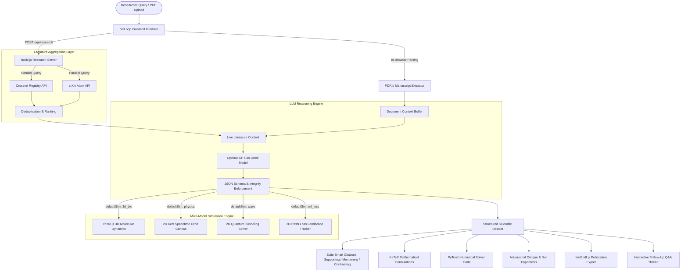

# 🔬 SciLoop Blueprint — Autonomous Scientific Research & Discovery Platform

## 1. System Vision & Architecture
SciLoop is an autonomous scientific research companion designed to mirror the capabilities of elite research tools such as **Scite.ai Assistant** while adding deep multi-modal simulation and automated scientific machine learning synthesis. 

Unlike single-domain or purely text-based LLMs, SciLoop unifies:
1. **Live Literature Grounding**: Parallel querying across global peer-reviewed registries (Crossref) and preprints (arXiv).
2. **Context & Document Ingestion**: In-browser client-side parsing of full PDF manuscripts, Markdown notes, and laboratory reports without external backend bottlenecks.
3. **Structured Mathematical Synthesis**: Translates scientific queries into governing differential equations and thermodynamic models rendered in KaTeX.
4. **Physical & Chemical Attribute Decomposition**: Quantifies state variables, units, symbols, and physical implications.
5. **Real-time 2D/3D Multi-Modal Simulations**: Instantaneous visualization across molecular biology, general relativity, quantum mechanics, and physics-informed neural networks.
6. **Adversarial Falsification**: Automatically tests null hypotheses ($H_0$), identifies confounding variables, and establishes quantitative refutation criteria.
7. **Publication-Ready Export**: Produces high-resolution, vector-accurate PDF reports formatted to academic standards.

---

## 2. Architectural Blueprint



---

## 3. Core Subsystems

### 3.1. Document Ingestion Subsystem (`simulation-3d/app.js`)
- **PDF Extraction**: Employs `pdfjs-dist` to parse uploaded academic papers in the browser, extracting clean text tokens page by page (up to 20 pages / 24,000 characters).
- **Text & Markdown Sanitization**: Strips excessive whitespace, normalizes UTF-8 characters, and injects context directly into the prompt payload.

### 3.2. Real-Time Literature Engine (`server.js`)
- **Crossref Endpoint**: Queries `https://api.crossref.org/works?query=...` with strict timeout controls. Extracts DOIs, titles, author lists, and container titles.
- **arXiv Endpoint**: Queries `https://export.arxiv.org/api/query?search_query=all:...` for cutting-edge preprints in quantitative biology, astrophysics, quantum physics, and computer science.

### 3.3. Multi-Modal Simulation Suite
| Simulation Mode | Engine | Governing Physics / Chemistry | Interactive Controls |
|---|---|---|---|
| **🧬 3D Molecular Dynamics** | Three.js WebGL | EGFR Kinase Domain (1M17), $\alpha$-helices, $\beta$-sheets, ligand binding conformers, H-bonds, steric clashes | 60-frame playback, rotation speed, atom raycasting, orbit controls |
| **🌌 Relativistic Orbits** | HTML5 2D Canvas | Kerr/Schwarzschild metric geodesics, frame dragging, perihelion precession | Eccentricity, orbital speed, particle trails |
| **🌊 Quantum Tunneling** | HTML5 2D Canvas | 1D Time-Dependent Schrödinger Equation, barrier potential $V_0$, width $a$, transmission coefficient $T$ | Potential barrier height, wave packet dispersion |
| **📊 PINN Loss Landscape** | HTML5 2D Canvas | Navier-Stokes / PDE physics loss vs boundary collocation loss convergence | Epoch progression, gradient descent trajectory |

### 3.4. Scientific Rigor & Critique Engine
In accordance with Popperian falsifiability, every dossier generated by SciLoop must contain:
1. **Null Hypothesis ($H_0$)**: Explicit statement of no effect or default baseline condition.
2. **Confounders & Caveats**: Known observational biases, assay limitations, or numerical instability regimes.
3. **Falsification Threshold**: Quantitative metric (e.g., $p > 0.05$, RMSD $> 3.5 \text{ Å}$, loss divergence $> 10^{-2}$) that invalidates the model.

---

## 4. API Specification

### Endpoint: `/api/research` [POST]
Synthesizes a research inquiry or uploaded manuscript into a complete scientific dossier.

#### Request Body
```json
{
  "query": "string (required)",
  "documentContext": "string (optional, extracted text)",
  "apiKey": "string (optional, defaults to server .env)",
  "model": "string (optional, e.g., 'gpt-4o', 'gpt-4o-mini')"
}
```

#### Response Payload
```json
{
  "success": true,
  "data": {
    "title": "string",
    "summary": "string with [1], [2] citations",
    "supportingCount": 24,
    "mentioningCount": 38,
    "contrastingCount": 2,
    "defaultSim": "3d_bio | physics | wave | ml_loss",
    "simParams": { "speed": 1.0, "notes": "string" },
    "equations": [
      { "title": "string", "latex": "string", "desc": "string" }
    ],
    "attributes": [
      { "name": "string", "sym": "string", "val": "string", "unit": "string", "desc": "string" }
    ],
    "codeFileName": "string",
    "code": "string",
    "citations": [
      { "id": "string", "title": "string", "meta": "string", "url": "string", "classification": "Supporting | Mentioning | Contrasting" }
    ],
    "critique": [
      { "label": "string", "desc": "string" }
    ]
  },
  "liveLiterature": [ /* Array of Crossref & arXiv papers */ ]
}
```

### Endpoint: `/api/chat` [POST]
Follow-up interactive dialogue grounded in the active dossier context.

#### Request Body
```json
{
  "message": "string (required)",
  "context": "string (optional, active dossier summary/equations)",
  "apiKey": "string (optional)",
  "model": "string (optional)"
}
```

---

## 5. Deployment & Execution
SciLoop runs natively in Node.js with zero external binary dependencies. All client components load smoothly via secure CDNs (Three.js, KaTeX, PDF.js, html2pdf.js).
