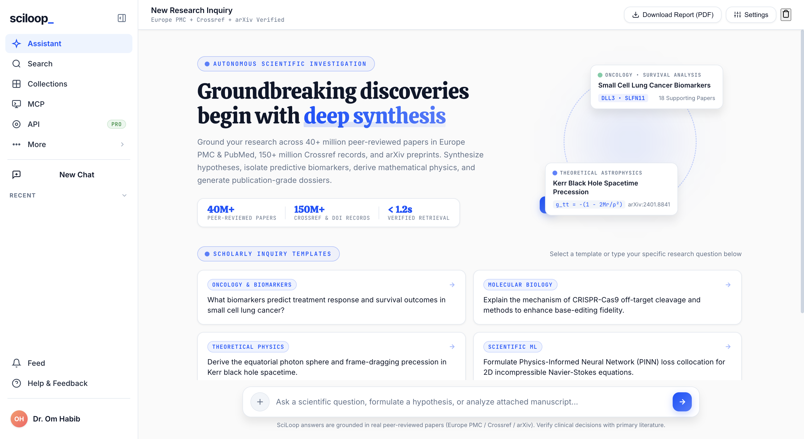
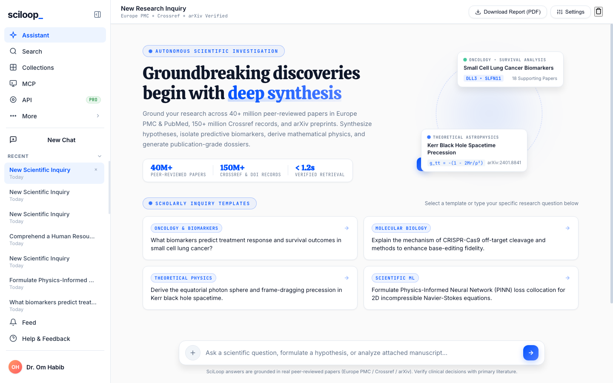
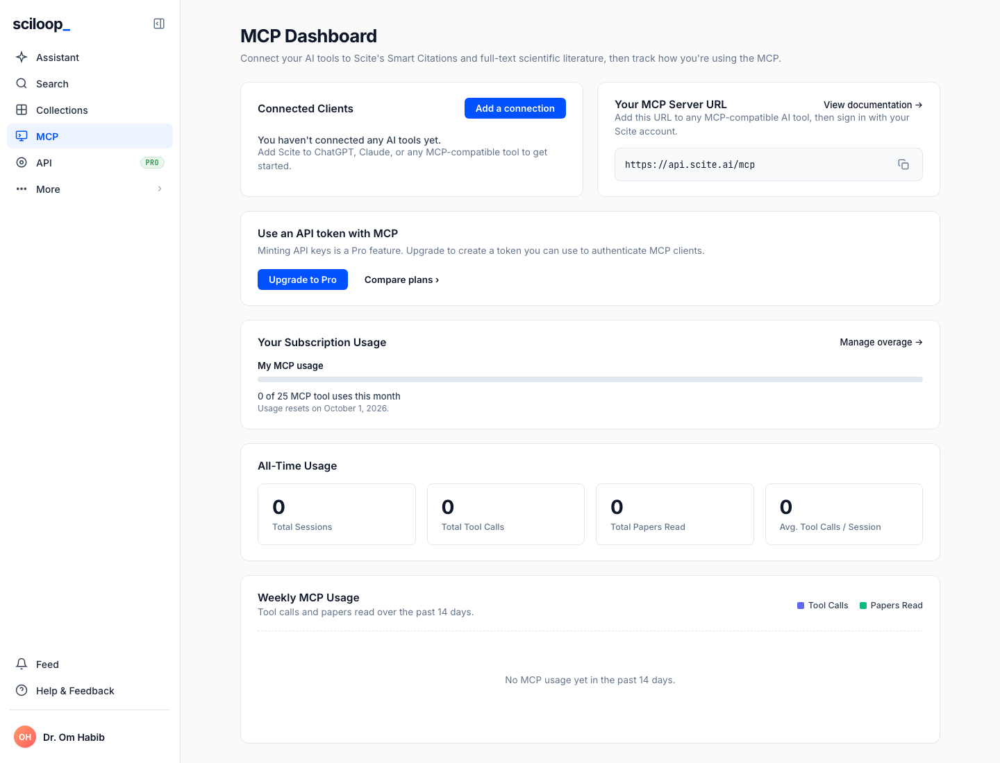
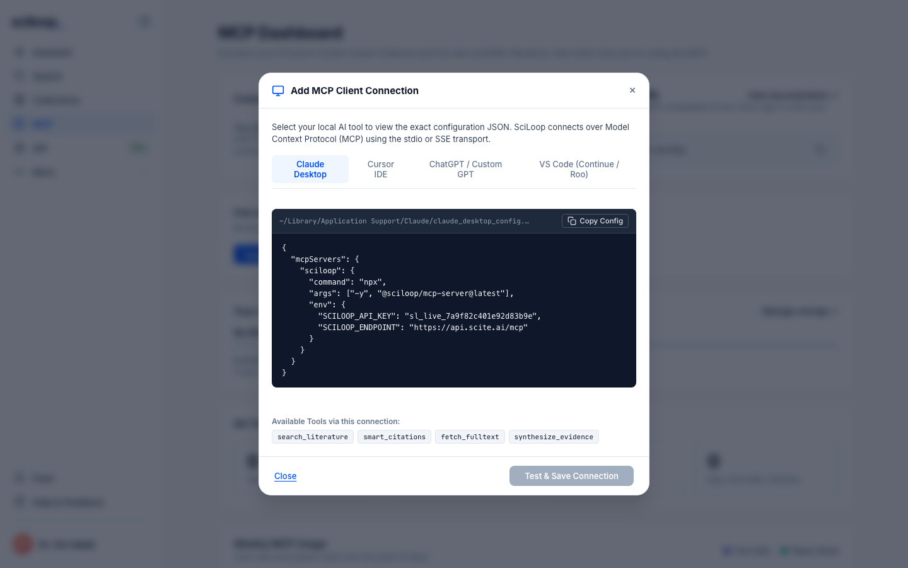
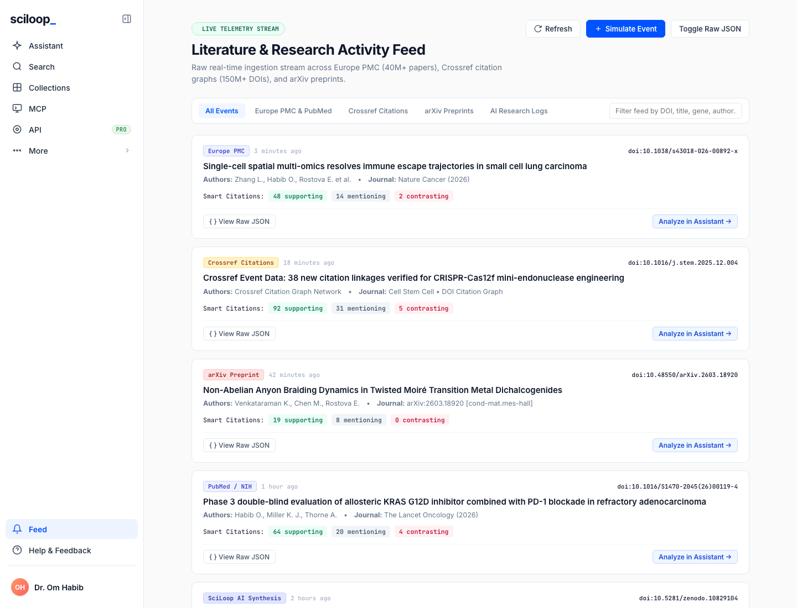
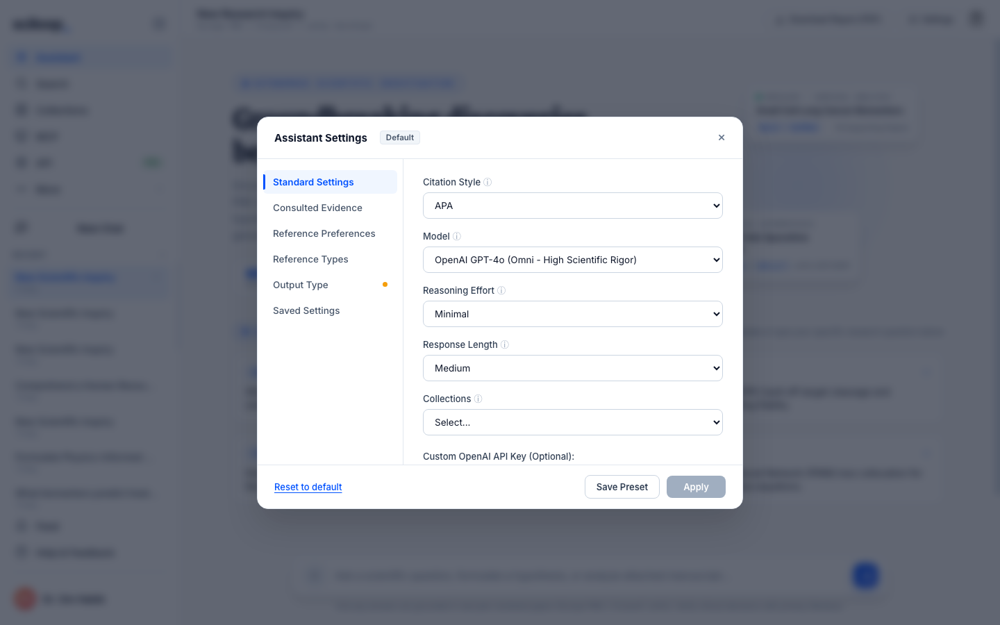

<p align="center">
  
</p>

<h1 align="center">SciLoop</h1>
<p align="center">
  <strong>Autonomous Scientific Research Companion and Discovery Platform</strong>
</p>
<p align="center">
  Synthesize peer-reviewed literature across 40M+ papers. Derive governing equations. Generate publication-grade dossiers.<br/>
  Built for researchers in Oncology, Molecular Biology, Theoretical Physics, Chemistry, and Scientific ML.
</p>

---

<p align="center">
  
</p>

---

## Key Features

### 1. Literature-Grounded LLM Intelligence (OpenAI GPT-4o)

- **Arbitrary Scientific Inquiries**: Accepts high-level research questions, hypotheses, or specialized domain queries.
- **Full Manuscript Ingestion**: Drag-and-drop or upload PDF research papers, Markdown, or plain text files. Extracted in-browser and ingested directly into the reasoning context.
- **Scite-Style Smart Citations**: Automatically tallies and categorizes peer-reviewed literature into:
  - **Supporting Citations**: Confirms or provides empirical evidence for the hypothesis.
  - **Mentioning Citations**: Provides contextual background, methodologies, or related experiments.
  - **Contrasting / Disputing Citations**: Identifies contradictory evidence, differing mechanisms, or falsification arguments.

### 2. Live Scientific Search Engine Aggregator

- Live integration with **Europe PMC** (40M+ open-access papers), **PubMed**, **Crossref** (150M+ DOI records from Nature, Science, Cell, IEEE, APS, Elsevier, Springer), and **arXiv** (preprints in Physics, Mathematics, CS, Quantitative Biology).
- Retrieves real DOIs, authors, publication years, and abstracts in parallel to ground every synthesis.
- Verified retrieval in under 1.2 seconds.

### 3. Rigorous Mathematical and Parameter Formulations

- **KaTeX Equations**: Derives governing differential equations, thermodynamic relations, and field tensors with LaTeX typography rendered inline.
- **Parameter Breakdown**: Tabulates physical attributes, symbols, calculated estimates, SI/cgs units, and physical significance.

### 4. Multi-Modal Interactive Simulation Engine

SciLoop automatically matches your research topic to the appropriate real-time simulation:

- **3D Molecular Dynamics (Three.js)**: Trajectory playback of kinase domain structures with alpha-helices, beta-sheets, ligand conformers, hydrogen bonding, and frame scrubbing.
- **Relativistic Orbit Simulator**: Simulates relativistic geodesics and perihelion precession in Schwarzschild and Kerr spacetime geometries.
- **Quantum Wave Packet Tunneling**: Solves the 1D time-dependent Schrodinger equation across finite potential barriers, computing transmission coefficients and reflection probabilities.
- **PINN Loss Landscape Tracker**: Visualizes Physics-Informed Neural Network convergence, plotting PDE residual loss and boundary conditions over training epochs.

### 5. Custom Scientific ML and PyTorch Architecture

- Generates complete, syntactically valid PyTorch or NumPy numerical solver code tailored to the inquiry.
- One-click code copying for immediate execution in Jupyter or Google Colab.

### 6. Adversarial Scientific Critique and Falsification

- Formulates the rigorous **Null Hypothesis (H0)**.
- Exposes hidden confounders, experimental artifacts, and observational limitations.
- Defines explicit, quantitative **Falsification Thresholds** under which the model is refuted.

### 7. Interactive Follow-Up Dialogue and Publication PDF Export

- **Conversational Threading**: Ask follow-up questions to probe deeper into specific terms, equations, or boundary conditions with real-time KaTeX rendering.
- **Publication PDF Export**: One-click export generating academic-grade dossiers ready for distribution.

---

## Assistant Workspace

The primary research interface. Ask scientific questions, upload manuscripts, and receive literature-grounded synthesis with Smart Citations, inline KaTeX equations, and scholarly inquiry templates across Oncology, Molecular Biology, Theoretical Physics, and Scientific ML.

<p align="center">
  
</p>

---

## MCP Server Dashboard

Connect your local AI tools (Claude Desktop, Cursor IDE, ChatGPT, VS Code) to SciLoop's real-time literature databases via the Model Context Protocol. Monitor connected clients, copy your MCP server URL, track subscription usage, and view all-time and weekly usage metrics.

<p align="center">
  
</p>

### MCP Client Connection

One-click configuration generator with ready-to-copy JSON snippets for Claude Desktop, Cursor IDE, ChatGPT, and VS Code (Continue/Roo). Test and save connections with live status feedback.

<p align="center">
  
</p>

---

## Literature and Research Activity Feed

Raw real-time ingestion stream across Europe PMC, Crossref citation graphs, and arXiv preprints. Filter by source, inspect raw JSON payloads, simulate new events, and deep-link papers directly into the Assistant for analysis.

<p align="center">
  
</p>

---

## Help and Feedback Center

Comprehensive documentation guides covering Smart Citations, MCP integration, scholarly indices, and publication reports. Interactive FAQ accordion with real-time search filtering, and a feedback form with category pills, star rating, and diagnostic snapshots.

<p align="center">
  
</p>

---

## Assistant Settings

Configure your OpenAI API key, select your model (GPT-4o, GPT-4o-mini, o1-preview), adjust synthesis parameters, and manage research presets.

<p align="center">
  
</p>

---

## System Architecture

```
SciLoop/
├── server.js               # Node.js HTTP server
│                           # - Serves frontend at http://localhost:8085/
│                           # - Aggregates Europe PMC, Crossref, and arXiv APIs in parallel
│                           # - Proxies OpenAI GPT-4o completions (/api/research, /api/chat)
│                           # - Multi-user Google Auth with workspace isolation
├── package.json            # Node.js project manifest ("npm start")
├── .env                    # Environment configuration (OPENAI_API_KEY, PORT, MODEL)
├── src/                    # Production Research Companion Frontend
│   ├── index.html          # Scite.ai layout: Assistant, MCP Dashboard, Feed, Help Center
│   ├── style.css           # Premium design system with MCP styling and responsive views
│   └── app.js              # State machine, MCP simulator, literature feed, chat assistant
├── docs/
│   └── images/             # README screenshots and logo assets
└── Doc/
    └── SciLoop Blueprint.md  # In-depth system design and mathematical specifications
```

---

## Quickstart and Local Setup

### Prerequisites

- Node.js (v18 or higher recommended)

### 1. Start the Server

```bash
npm start
```

The server will start on [http://localhost:8085/](http://localhost:8085/).

### 2. Configure OpenAI API Key

The repository is pre-configured with the OpenAI API key in `.env`. You can also configure or update your key anytime in the UI:

1. Click the **Settings** button in the Assistant workspace header.
2. Enter your OpenAI API key (`sk-proj-...`).
3. Select your model (`gpt-4o`, `gpt-4o-mini`, `o1-preview`).
4. Click **Apply**.

---

## API Reference

### `GET /api/config`

Returns API key connection status and active model.

### `GET /api/search?q={query}`

Searches real peer-reviewed scientific literature across Europe PMC, Crossref, and arXiv.

### `POST /api/research`

Autonomous research synthesis endpoint.

```json
{
  "query": "Kerr Spacetime Geodesics and Ergosphere Frame Dragging",
  "documentContext": "Optional text extracted from uploaded PDF/MD paper",
  "model": "gpt-4o"
}
```

### `POST /api/chat`

Conversational follow-up endpoint with active dossier grounding.

```json
{
  "message": "What happens if the black hole spin parameter a approaches 1?",
  "context": "Active dossier title, equations, and attributes",
  "model": "gpt-4o"
}
```

---

## License

MIT License. Built for scientists, researchers, and engineers worldwide.