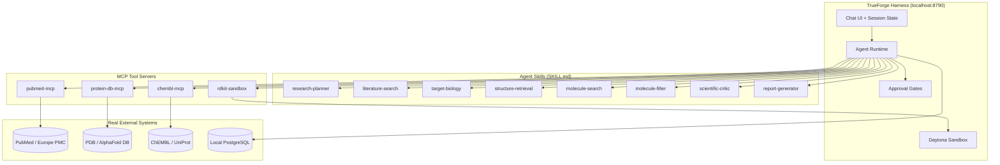

# 🧬 SciLoop × TrueForge — Hackathon Plan

## Agent Name: **SciLoop** — Autonomous Scientific Research Campaign Agent

> An AI agent that connects to real scientific databases, generates and executes computational biology experiments inside a sandbox, and stops before irreversible actions (publishing results, modifying datasets) to wait for human approval.

---

## 1. Why This Fits the Challenge

| Hackathon Requirement | How SciLoop Delivers |
|---|---|
| **Reach a real system** | PubMed/Europe PMC APIs, PDB/AlphaFold DB, ChEMBL, UniProt — live queries, not mocked |
| **Run generated code in a sandbox** | All RDKit/Biopython scripts execute inside Daytona sandbox (already connected at `localhost:8790`) |
| **Stop before irreversible actions** | Human approval gates before: finalizing a research report, writing to a database, modifying candidate rankings, triggering expensive GPU docking |
| **Genuinely worth handing over to AI** | A researcher can kick off a campaign ("Investigate EGFR as a lung cancer target") and the agent autonomously retrieves literature, assesses the target, fetches structures, generates candidates, filters them, and produces an evidence-backed report — work that takes a human days |

---

## 2. Architecture Overview



---

## 3. Scoped MVP for Hackathon Demo

> [!IMPORTANT]
> The full SciLoop blueprint has 7 phases. For the hackathon, we build **Phase 0 + Phase 1** only — one end-to-end research campaign that proves the architecture.

### Demo Scenario
**Research Question:** *"Investigate whether EGFR (Epidermal Growth Factor Receptor) is a computationally promising therapeutic target for non-small cell lung cancer and identify candidate molecules for further study."*

### What the Agent Does (Live Demo Flow)

| Step | Agent Action | Real System Touched | Sandbox? | Human Gate? |
|---|---|---|---|---|
| 1 | Parse research question, generate hypotheses | — | No | No |
| 2 | Search PubMed for EGFR + NSCLC evidence | PubMed E-utilities API | No | No |
| 3 | Extract claims, build evidence set with citations | — | No | No |
| 4 | Assess target validity (pathway, genetic evidence) | UniProt API | No | No |
| 5 | Retrieve protein structure | PDB / AlphaFold DB API | No | No |
| 6 | 🛑 **Present research plan for approval** | — | — | **YES** |
| 7 | Search ChEMBL for known active compounds | ChEMBL API | No | No |
| 8 | Run RDKit filtering (Lipinski, PAINS, validity) | Sandbox (Daytona) | **YES** | No |
| 9 | Score and rank candidates | Sandbox (Daytona) | **YES** | No |
| 10 | Critic: search for contradictory evidence | PubMed API | No | No |
| 11 | 🛑 **Present ranked candidates + evidence for approval** | — | — | **YES** |
| 12 | Generate final research report with provenance | Local PostgreSQL | No | No |
| 13 | 🛑 **Approve report before "publish"** | — | — | **YES** |

---

## 4. Implementation Plan

### Phase A: Foundation (Day 1 Morning)

#### A1. Project Scaffolding
```
SciLoop/
├── mcp-servers/
│   ├── pubmed-server/        # MCP server wrapping PubMed E-utilities
│   │   ├── index.ts
│   │   ├── package.json
│   │   └── tools/
│   ├── protein-db-server/    # MCP server for PDB + AlphaFold DB
│   │   ├── index.ts
│   │   └── tools/
│   └── chembl-server/        # MCP server for ChEMBL REST API
│       ├── index.ts
│       └── tools/
├── skills/
│   ├── research-planner/
│   │   └── SKILL.md
│   ├── literature-search/
│   │   └── SKILL.md
│   ├── target-biology/
│   │   └── SKILL.md
│   ├── structure-retrieval/
│   │   └── SKILL.md
│   ├── molecule-search/
│   │   └── SKILL.md
│   ├── molecule-filter/
│   │   └── SKILL.md
│   ├── scientific-critic/
│   │   └── SKILL.md
│   └── report-generator/
│       └── SKILL.md
├── sandbox-scripts/
│   ├── rdkit_filter.py       # Lipinski + PAINS + validity
│   ├── molecule_score.py     # Multi-objective scoring
│   └── requirements.txt      # rdkit, biopython, numpy
├── schemas/
│   ├── hypothesis.json
│   ├── evidence.json
│   ├── experiment.json
│   └── candidate.json
├── db/
│   └── init.sql              # PostgreSQL schema for provenance
├── Doc/
│   └── SciLoop Blueprint.md
└── README.md
```

#### A2. Database Schema (PostgreSQL)
```sql
-- Campaigns, hypotheses, evidence, experiments, candidates
CREATE TABLE campaigns (
    id UUID PRIMARY KEY DEFAULT gen_random_uuid(),
    research_question TEXT NOT NULL,
    status TEXT DEFAULT 'active',
    created_at TIMESTAMPTZ DEFAULT now()
);

CREATE TABLE hypotheses (
    id UUID PRIMARY KEY DEFAULT gen_random_uuid(),
    campaign_id UUID REFERENCES campaigns(id),
    statement TEXT NOT NULL,
    confidence FLOAT,
    evidence_for JSONB DEFAULT '[]',
    evidence_against JSONB DEFAULT '[]',
    created_at TIMESTAMPTZ DEFAULT now()
);

CREATE TABLE evidence (
    id UUID PRIMARY KEY DEFAULT gen_random_uuid(),
    campaign_id UUID REFERENCES campaigns(id),
    source_type TEXT CHECK (source_type IN (
        'literature', 'computational_prediction', 'model_hypothesis'
    )),
    claim TEXT NOT NULL,
    citation TEXT,
    pmid TEXT,
    provenance JSONB,
    created_at TIMESTAMPTZ DEFAULT now()
);

CREATE TABLE candidates (
    id UUID PRIMARY KEY DEFAULT gen_random_uuid(),
    campaign_id UUID REFERENCES campaigns(id),
    smiles TEXT NOT NULL,
    source TEXT,
    lipinski_pass BOOLEAN,
    pains_pass BOOLEAN,
    mw FLOAT,
    logp FLOAT,
    score JSONB,
    rank INTEGER,
    created_at TIMESTAMPTZ DEFAULT now()
);
```

---

### Phase B: MCP Tool Servers (Day 1 Afternoon)

#### B1. PubMed MCP Server
Tools exposed:
- `search_pubmed(query, max_results)` — search E-utilities, return structured results
- `fetch_abstract(pmid)` — get full abstract + metadata
- `extract_claims(text)` — LLM-assisted claim extraction with PMID provenance

#### B2. Protein DB MCP Server
Tools exposed:
- `search_pdb(gene_name, organism)` — find crystal structures
- `fetch_alphafold(uniprot_id)` — get AlphaFold predicted structure + pLDDT
- `get_uniprot_info(gene_name)` — protein function, domains, pathways

#### B3. ChEMBL MCP Server
Tools exposed:
- `search_target(gene_name)` — find ChEMBL target ID
- `get_active_compounds(target_id, activity_type, threshold)` — known actives
- `get_compound_details(chembl_id)` — SMILES, properties, assay data

---

### Phase C: Skills (Day 1 Evening)

Each skill is a `SKILL.md` file that TrueForge loads on demand. They define the agent's domain-specific reasoning patterns.

#### C1. `research-planner` SKILL.md (core orchestrator)
```markdown
---
name: research-planner
description: Plans and orchestrates a scientific research campaign
---
# Research Planner

You are a scientific research planner. Given a research question:

1. Decompose it into testable hypotheses
2. Define evidence requirements for each hypothesis
3. Plan the sequence of computational experiments
4. Set stopping criteria and budget constraints
5. **ALWAYS present the research plan to the user for approval before proceeding**

## Evidence Types (NEVER confuse these)
- `model_hypothesis` — your own reasoning (lowest weight)
- `literature` — from PubMed with PMID (medium weight)
- `computational_prediction` — from RDKit/scoring (must label as prediction)

## Approval Gates
You MUST stop and ask for human approval at these points:
1. After presenting the research plan
2. After ranking candidate molecules
3. Before generating the final report
```

#### C2. `molecule-filter` SKILL.md (sandbox execution)
```markdown
---
name: molecule-filter
description: Filters and scores candidate molecules using RDKit in the sandbox
---
# Molecule Filter

Execute the following Python scripts in the Daytona sandbox:

1. `rdkit_filter.py` — Run Lipinski Rule of Five + PAINS filters
2. `molecule_score.py` — Multi-objective scoring

## Rules
- NEVER claim a computational prediction is a validated result
- Always include uncertainty estimates
- Label every output as "computational prediction"
```

---

### Phase D: Sandbox Scripts (Day 2 Morning)

#### D1. `rdkit_filter.py`
```python
"""Filter molecules using RDKit: Lipinski + PAINS + validity checks."""
from rdkit import Chem
from rdkit.Chem import Descriptors, FilterCatalog
import json, sys

def filter_molecules(smiles_list):
    results = []
    # PAINS filter catalog
    params = FilterCatalog.FilterCatalogParams()
    params.AddCatalog(FilterCatalog.FilterCatalogParams.FilterCatalogs.PAINS)
    catalog = FilterCatalog.FilterCatalog(params)
    
    for smi in smiles_list:
        mol = Chem.MolFromSmiles(smi)
        if mol is None:
            results.append({"smiles": smi, "valid": False})
            continue
        
        mw = Descriptors.MolWt(mol)
        logp = Descriptors.MolLogP(mol)
        hbd = Descriptors.NumHDonors(mol)
        hba = Descriptors.NumHAcceptors(mol)
        
        lipinski = (mw <= 500 and logp <= 5 and hbd <= 5 and hba <= 10)
        pains_pass = not catalog.HasMatch(mol)
        
        results.append({
            "smiles": smi,
            "valid": True,
            "mw": round(mw, 2),
            "logp": round(logp, 2),
            "hbd": hbd, "hba": hba,
            "lipinski_pass": lipinski,
            "pains_pass": pains_pass,
            "pass_all": lipinski and pains_pass
        })
    return results

if __name__ == "__main__":
    data = json.load(sys.stdin)
    print(json.dumps(filter_molecules(data["smiles"]), indent=2))
```

#### D2. `molecule_score.py`
```python
"""Multi-objective scoring — exposes trade-offs, no single opaque score."""
import json, sys

def score_candidates(candidates):
    scored = []
    for c in candidates:
        if not c.get("pass_all"):
            continue
        score_vector = {
            "drug_likeness": 1.0 if c["lipinski_pass"] else 0.0,
            "pains_clean": 1.0 if c["pains_pass"] else 0.0,
            "mw_penalty": max(0, 1 - abs(c["mw"] - 350) / 150),
            "logp_optimal": max(0, 1 - abs(c["logp"] - 2.5) / 2.5),
        }
        c["score_vector"] = score_vector
        c["composite_note"] = "This is a weighted heuristic, NOT a validated metric"
        scored.append(c)
    
    scored.sort(key=lambda x: sum(x["score_vector"].values()), reverse=True)
    for i, c in enumerate(scored):
        c["rank"] = i + 1
    return scored

if __name__ == "__main__":
    data = json.load(sys.stdin)
    print(json.dumps(score_candidates(data["candidates"]), indent=2))
```

---

### Phase E: Agent Configuration in TrueForge (Day 2 Afternoon)

#### E1. Register MCP Servers
In TrueForge Settings → Connectors, add:
- `pubmed-mcp` → `http://localhost:3001`
- `protein-db-mcp` → `http://localhost:3002`
- `chembl-mcp` → `http://localhost:3003`

#### E2. Create the SciLoop Agent
In TrueForge → Build Agent:

```yaml
name: SciLoop
description: >
  Autonomous scientific research agent for computational drug discovery.
  Investigates biological targets, retrieves evidence from real databases,
  generates and filters candidate molecules in a sandbox, and produces
  evidence-backed research reports with full provenance.

system_prompt: |
  You are SciLoop, an autonomous scientific research agent.
  
  YOUR CAPABILITIES:
  - Search PubMed for scientific literature
  - Query UniProt, PDB, and AlphaFold for protein/structure data
  - Search ChEMBL for known active compounds
  - Run RDKit molecular filtering in a secure sandbox
  - Score and rank candidates using multi-objective criteria
  - Track evidence with full provenance (source, citation, type)
  
  YOUR RULES:
  1. NEVER claim a computational prediction is experimentally validated
  2. ALWAYS cite sources with PMIDs or database IDs
  3. ALWAYS distinguish between: model_hypothesis, literature, computational_prediction
  4. STOP and ask for human approval at these gates:
     - After presenting research plan
     - After ranking candidates
     - Before finalizing research report
  5. Run all molecular computations inside the sandbox
  6. If uncertain, say so. Never fabricate citations.
  
  YOUR WORKFLOW:
  1. Understand the research question
  2. Generate hypotheses
  3. Search literature for evidence
  4. Assess target biology
  5. Retrieve protein structures
  6. PRESENT PLAN → WAIT FOR APPROVAL
  7. Search for candidate molecules
  8. Filter candidates in sandbox (RDKit)
  9. Score and rank candidates
  10. Run scientific criticism
  11. PRESENT CANDIDATES → WAIT FOR APPROVAL
  12. Generate research report with provenance
  13. PRESENT REPORT → WAIT FOR APPROVAL

model: gpt-4o  # or claude-sonnet-4 via TrueFoundry AI Gateway
skills:
  - research-planner
  - literature-search
  - target-biology
  - structure-retrieval
  - molecule-search
  - molecule-filter
  - scientific-critic
  - report-generator

tools:
  - pubmed-mcp
  - protein-db-mcp
  - chembl-mcp

sandbox: daytona  # Already connected
```

#### E3. Wire Human Approval Gates
TrueForge's built-in `ask_user` tool handles this natively. The agent's system prompt + skills instruct it to call `ask_user` at the three gates. No custom code needed.

---

## 5. What Makes This Stand Out

| Dimension | What We Show |
|---|---|
| **Real systems** | Live API calls to PubMed, PDB, AlphaFold, ChEMBL, UniProt — no mocks |
| **Sandbox execution** | RDKit molecular filtering runs in Daytona, not on host |
| **Human-in-the-loop** | 3 explicit approval gates at scientifically meaningful decision points |
| **Evidence provenance** | Every claim tagged with source type + citation + timestamp |
| **Scientific integrity** | Agent explicitly refuses to call predictions "facts" |
| **Multi-objective** | No single "best molecule" score — trade-offs are exposed |
| **Domain depth** | Not a generic chatbot — deep domain skill via SKILL.md files |
| **Production path** | Blueprint shows how this scales to Kubernetes/GPU (Phases 3-7) |

---

## 6. Build Timeline

| Block | Duration | Deliverable |
|---|---|---|
| **A. Scaffolding** | 2 hours | Project structure, DB schema, JSON schemas |
| **B. MCP Servers** | 4 hours | 3 working MCP servers hitting real APIs |
| **C. Skills** | 2 hours | 8 SKILL.md files with domain reasoning |
| **D. Sandbox Scripts** | 2 hours | RDKit filter + scorer, tested in Daytona |
| **E. Agent Config** | 1 hour | Agent wired in TrueForge with all tools + skills |
| **F. Integration Test** | 2 hours | Full EGFR campaign end-to-end |
| **G. Polish + Demo** | 2 hours | Recording, edge cases, README |
| **Total** | ~15 hours | |

---

## 7. Tech Stack

| Layer | Technology |
|---|---|
| Agent Harness | TrueForge (localhost:8790) |
| Sandbox | Daytona (already connected) |
| MCP Servers | Node.js / TypeScript + `@modelcontextprotocol/sdk` |
| Sandbox Scripts | Python 3.11 + RDKit + Biopython |
| Database | PostgreSQL (campaigns, evidence, candidates) |
| External APIs | PubMed E-utilities, PDB, AlphaFold DB, ChEMBL, UniProt |
| LLM | GPT-4o or Claude via TrueFoundry AI Gateway |

---

## 8. Risk Mitigation

| Risk | Mitigation |
|---|---|
| API rate limits on PubMed/ChEMBL | Cache responses locally, limit queries per campaign |
| RDKit install complexity in sandbox | Pre-built `requirements.txt`, tested Docker image |
| Agent drifts from scientific rigor | Skills enforce evidence typing + critic step |
| Demo fails on edge cases | Pre-tested with EGFR scenario; fallback cached data |
| Scope creep | Explicitly **NOT** building: docking, simulation, multi-agent orchestration, Kubernetes |

---

## 9. Connection to Full SciLoop Blueprint

> [!NOTE]
> This hackathon build is **Phase 0 + Phase 1** of the [SciLoop Blueprint](file:///Users/zenx/SciLoop/Doc/SciLoop%20Blueprint.md). The blueprint defines 7 phases scaling to distributed Kubernetes execution with GPU docking and simulation. This demo proves the scientific loop works before scaling the infrastructure.

```mermaid
gantt
    title SciLoop Roadmap — Hackathon Scope
    dateFormat X
    axisFormat %s

    section Hackathon
    Phase 0 - Schemas + Provenance    :done, 0, 1
    Phase 1 - Single-node Research     :done, 1, 2

    section Post-Hackathon
    Phase 2 - Closed-loop Agent        :3, 4
    Phase 3 - Distributed Execution    :4, 5
    Phase 4 - Search + Self-improvement:5, 6
    Phase 5 - Simulation               :6, 7
    Phase 6 - Experimental Feedback    :7, 8
    Phase 7 - General Scientific Engine:8, 9
```



---

## 10. Next Step

> [!TIP]
> Ready to start building? The recommended first action is:
> 1. Initialize the project structure under `/Users/zenx/SciLoop/`
> 2. Build the PubMed MCP server first (fastest to validate end-to-end)
> 3. Create the `research-planner` SKILL.md
> 4. Wire it into TrueForge and run the first campaign
